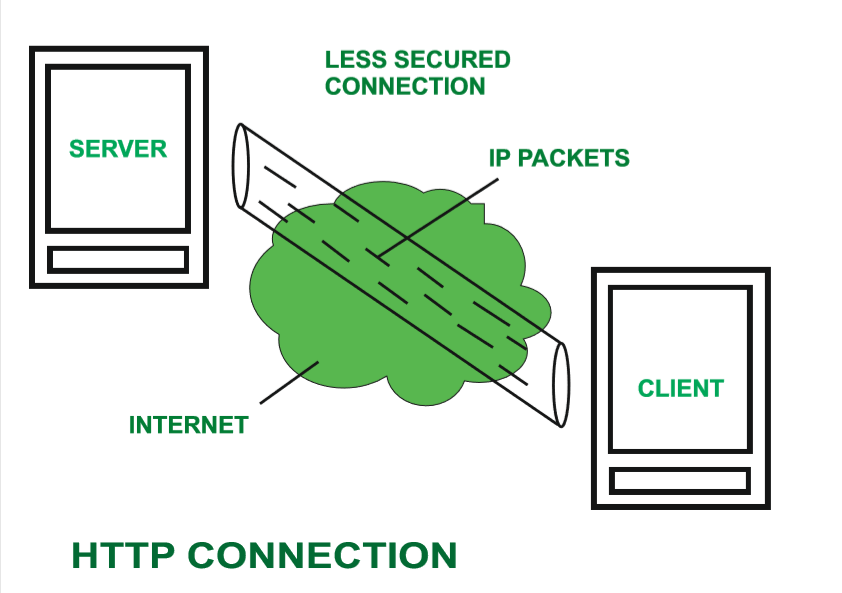
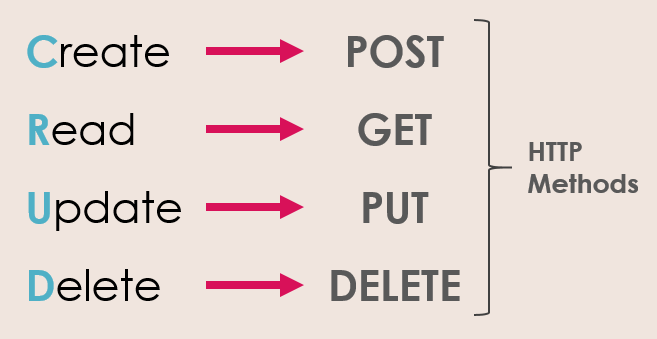

# JavaScript - Asynchronous Programming and Fetch API

*Intro / SWABTS : 1 - 3 minutes*
## Students will be able to: 
 * Explain the request response cycle
 * Define the fundamental HTTP Verbs 
 * Make a GET Request using the JavaScript fetch API
<br/>
<br/>

## Request Response Cycle

*Web Requests : 3 - 5 minutes*

 

 [Jen Strong, "The Request/Response Cycle of the Web"](https://medium.com/@jen_strong/the-request-response-cycle-of-the-web-1b7e206e9047)

 Have you ever wondered what happens behind the scenes when you type a URL into your browser? Your browser will send a request to a server, which then sends back a response. Your browser will process that response rendering the results to your screen. 

 When you log into a particlar web application, how is it that you see different results as compared to another user who logs in? The browser will render a basic template but make requests specific to the current user. 

 JavaScript does this via HTTP requests. 
<br/>
<br/>
**Check for understanding**

*CFU: 1 - 3 minutes*

What is something you could compare the request response cycle to?
<br/>
<br/>
 ## HTTP 
 *HTTP : 3 - 5 mins*

[ geeksforgeeks, "HTTP Full Form](https://www.geeksforgeeks.org/http-full-form/)
<br/>
<br/>
 HTTP - Hypertext Transfer Protocol

 HTTP is a protocol (or system of rules) for fetching resources such as HTML documents. It is the foundation of any data exchange on the Web and it is a client-server protocol, which means requests are initiated by the recipient, usually the Web browser. A complete document is reconstructed from the different sub-documents fetched, for instance, text, layout description, images, videos, scripts, and more.

 [ Mozilla, "An Overview of HTTP" 2022](https://developer.mozilla.org/en-US/docs/Web/HTTP/Overview/)

 HTTP is used by the browser, also called a client. The server sends back the response, along with any data requested. 
<br/>
<br/>
**Check for understanding**

*CFU: 1 - 3 minutes*

What does HTTP stand for?

What is HTTP in your own words?
<br/>
<br/>
**Requests**

An HTTP request is made up of verbs, which define the type of request, the address the request is sent to, and sometimes data. HTTP verbs correspond to actions that will take place in the database
<br/>
<br/>
**HTTP Verbs**
<br/>

GET - retrieves data from the server (READ)

POST - sends data to server (CREATE)

PATCH - updates a part of a resource (UPDATE)

PUT - updates all of a resource (UPDATE)

DELETE - deletes a resource (DELETE)
<br/>
<br/>


[Visual Paradigm, "What is REST API?"](https://www.visual-paradigm.com/guide/development/what-is-rest-api/)

**Check for understanding**

*CFU: 1 - 3 minutes*

What does an HTTP request consist of?

Which HTTP verb is used to retrieve data from the server?
<br/>
<br/>
## JavaScript Fetch API

*fetch API : 3 - 5 minutes*

The Fetch API provides a JavaScript interface for accessing and manipulating parts of the protocol, such as requests and responses. It also provides a global fetch() method that provides an easy, logical way to fetch resources asynchronously across the network.

[Mozilla, "Using the Fetch API"](https://developer.mozilla.org/en-US/docs/Web/API/Fetch_API/Using_Fetch)

The fetch() method takes one mandatory argument, the path to the resource you want to fetch. It returns a Promise that resolves to the Response to that request — as soon as the server responds with headers — even if the server response is an HTTP error status. You can also optionally pass in an init options object as the second argument (see Request).
[Mozilla, "Fetch API"](https://developer.mozilla.org/en-US/docs/Web/API/Fetch_API/Using_Fetch)

An asynchronous operation in JavaScript will return a Promise. A Promise is an object that will tell us which state the asynchronous operation is currently in. The three states of a Promise are : 

* pending (awaiting)
* fullfilled (completed)
* rejected (error)

[FreeCodeCamp, "JavaScript Promises"](https://www.freecodecamp.org/news/javascript-promise-methods/)

[JavaScript.info, "Promise"](https://javascript.info/promise-basics)

**Check for understanding**

*CFU: 1 - 3 minutes*

Explain the fetch API in plain english.

What are the 3 states of a Promise?
<br/>
<br/>

**fetch()**

*fetch() : 3 - 5 minutes*

The .fetch() method enables us to make an HTTP request to a specific URL. It will return a Promise. Once the Promise reaches the *fulfilled* state, we can pass it to .then()

```
// fetch data from a URL, by creating an HTTP GET request. It returns a promise.
// Once the promise has been fulfilled, the response is passed to .then() 
fetch(url)
.then()

// .then() takes a callback function
// Inside the callback we can convert the response into a JavaScript object by calling .json() on it. 
// .json() also returns a promise. We can chain another .then() onto our first .then() 

fetch(url)
.then(response => {
    //convert response data to JavaScript
    return response.json()
})
.then(data => console.log(data))
``` 

[JavaScripttutorial.net, "JavaScript Fetch API"](https://www.javascripttutorial.net/javascript-fetch-api/)

**Check for understanding**

*CFU: 1 - 3 minutes*

What is the .fetch() method used for?

What is the .then() method used for?